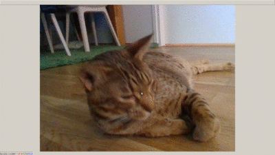
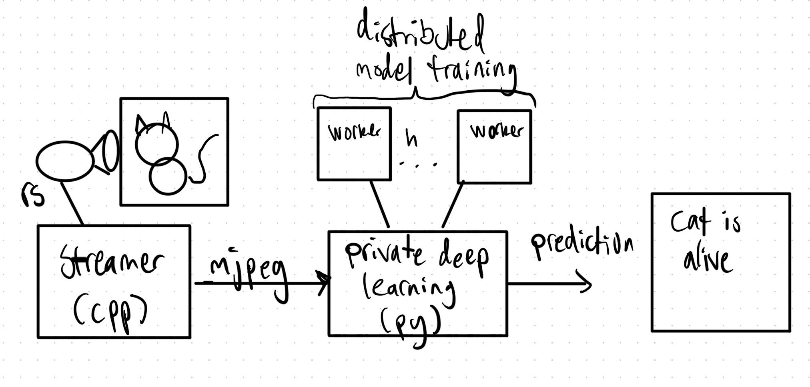

# Schroedingers

## Overview

> When a neural network looks in the box, the cat is either dead or alive.

A Schroedinger's cat themed play with federated neural network model training [pysyft](https://github.com/OpenMined/PySyft) to preserve private data and
predict cat classification with trained model from remote camera fed mjpeg stream.




Following diagram illustrates the components and their relation.



streamer streamers mjpeg from realsense camera to http://localhost:5000

python program cli.py can be used to train the model from cifar10 dataset using federated workers. By default, cli.py reads the frames from mjpeg stream, predicts using the model
and displays the result on local display.


## cpp - streamer

* librealsense to read framesets from a RealSense camera with frameset filtering
* Streams processed frames to neural network process (py) with mjpeg over http

### Dependencies and build instructions

On Ubuntu 18.04

#### Install dependencies
```
# realsense
sudo apt-key adv --keyserver keys.gnupg.net --recv-key C8B3A55A6F3EFCDE || sudo apt-key adv --keyserver hkp://keyserver.ubuntu.com:80 --recv-key C8B3A55A6F3EFCDE
sudo add-apt-repository "deb http://realsense-hw-public.s3.amazonaws.com/Debian/apt-repo bionic main" -u
sudo apt install librealsense2-dkms librealsense2-utils librealsense2-dev
# opencv - TODO: fix excess wildcard, not all libs used
sudo apt install libopencv*
```

#### Build
```
make
```

#### Usage

```
./streamer
new client 17
GET / HTTP/1.1
Accept-Encoding: identity
Host: localhost:5000
User-Agent: Python-urllib/3.6
Connection: close

```


## py - private deep learning - cli.py

#### Install dependencies
```
pip3 install click torch syft torchvision numpy

```

#### Usage
```
$ python3 cli.py --help
Usage: cli.py [OPTIONS]

Options:
  --count INTEGER             Number of workers
  --batch_size INTEGER        Batch size to share to federated workers
  --test_batch_size INTEGER   Test batch size
  --device TEXT               torch device to use: ["cpu"|"cuda"]
  --log_interval INTEGER
  --epochs INTEGER
  --model_filename TEXT
  --predict / -no-predict
  --generate / --no-generate
  --stream / --no_stream
  --stream_url TEXT           url to HTTP MJPEG stream
  --help                      Show this message and exit.

```

## Known issues

* Cifar10 based model with pytorch is fairly inaccurate at 59% accuracy on the training set. Using Keras to train the model with cifar10, prediction accuracy was better but federated learning would need more work.
* Depending on cats, they may or may not like the camera in their face. My sample size was 3. No cats were harmed in making this experiment.
